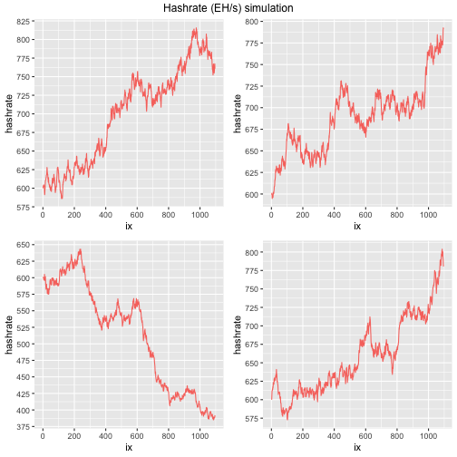

# Looking into Bitcoin mining using simulation

*Warning: This post is actively undergoing changes and does not constitute financial advice*

# Opportunity

### Background

An opportunity has presented itself via a company to invest in bitcoin mining by buying a number of ASIC miner machines which will be hosted at a hashlabs facility in Ethiopia. Ethiopia has demonstrated a large comparative advantage with their cheap electricity and scale of production as a result of hydropower. According to https://www.globalpetrolprices.com/Ethiopia/electricity_prices/, business electricity rates are USD 0.021 kWh. 

### Costs

The hosting rate available to us is USD 0.055/kWh. The recommended machine by hashlabs is the Antminer T21 which has the capabilities to run at 190TH/s and requires 86.4 kWh per day. The machines specs can be found here https://bitmars.io/product/bitmain-antminer-t21-190t/. 

This means daily cost for one machine is around 4.752 USD. Hosting costs will be paid monthly by us using the bitcoin mined by our machines. A portion of these bitcoins might need to be saved in order to fund the purchases of new machines as the ones being offered to us will have a lifespan of 4-5 years as stated by the company, however it is likely that we need to replace them earlier to remain competitive in the market.

### Breakdown

If we purchase 55 machines what is our revenue and costs?

<table class="table" style="">
 <thead>
  <tr>
   <th style="text-align:left;"> Annual </th>
   <th style="text-align:right;"> BTC </th>
   <th style="text-align:left;"> USD </th>
  </tr>
 </thead>
<tbody>
  <tr>
   <td style="text-align:left;"> Revenue </td>
   <td style="text-align:right;"> 2.98 </td>
   <td style="text-align:left;"> 198k </td>
  </tr>
  <tr>
   <td style="text-align:left;"> Cost </td>
   <td style="text-align:right;"> 1.44 </td>
   <td style="text-align:left;"> 96k </td>
  </tr>
  <tr>
   <td style="text-align:left;"> Profit </td>
   <td style="text-align:right;"> 1.54 </td>
   <td style="text-align:left;"> 102k </td>
  </tr>
</tbody>
</table>

The current cost of each machine as quoted to us on the 23rd of July is 3,575 USD. 55 machines will give us an initial cost of 196,625 USD. This would give us a return of 51.9% return 

# Simulation

### Motivation

1 - It is vital to understand how fluctuations in price and global hashrate affect returns since we will be running the machines for a few years. This is because the bitcoin market is cyclical, beginning with a bear market, entering a bull market and then ending with a large drawdown. These cycles tend to match up with US elections and a major event which precedes large upward price movements are bitcoin halving events where the reward for miners is halved. This also leads to much more difficulty in mining which forces miners to switch of their current machines and buy more competitive ones.

2 - We also need to understand whether or not, given our understanding of global hashrate, the machines on offer have a good ROI compared to more expensive and competitive machines. We will compare the returns of the T21 Antminer 190T and the Bitcoin Miner S21 Hyd 335T.

### Simulation assumptions

We are using a geometric brownian distribution model to simulate global hashrate and bitcoin price randomly for three years. For the purposes of this exercise, we will assume that we sell some bitcoin daily to fund daily costs.

We will create 4 different scenarios some very positive and some very negative to help us account for all scenarios.

### Hashrate simulation

Here we are simulating 4 different paths the potential global hashrate could take using the distribution. This will allow us later to observe our share of this hashrate to work out how much of the daily bitcoin mined will be earned by our machines.

Understanding global hashrate is important. This is because mining bitcoin is a global competition and extremely cutthroat. Many large miners are forced to shut down machines due to increasing costs and difficulties in mining bitcoin. Miner capitulation post halving is common and there are indicators that can help in detecting when competition for hashrate goes down. A useful article to read is linked here https://medium.com/capriole/hash-ribbons-bitcoin-bottoms-60da13095836. 

### Bitcoin price simulation

Below we have used the same distribution to simulate possible pathways for bitcoin over the next three years. This will help us to understand the potential value for the bitcoin mined daily and work out daily profit by multiplying the bitcoin earned by the daily bitcoin price minus hosting costs. It can also help us to understand what the breakeven cost for mining given our machine type and total hosting costs will be.

Bitcoin price can fluctuate due to a variety of reasons. Geopolitics, priced in narratives, market makers etc. However, due to its' characteristics such as the hardcap and accessibility, it has remained very sturdy and still exists after 15 years. 

### Daily profit graphs

Here, for the T21 Antminer machines, we have worked out what the daily profit could look like under the 4 different pathways of bitcoin price and hashrate. The volatility of daily profit is to be expected due to hashrate and bitcoin price but it does seem favourable over all three years in general except for version 4 of the simulation.

These profit graphs only look at a daily selling strategy to pay for "daily hosting fee". In reality, this amount is charged monthly so we may want to hold the bitcoin until the end of the month and then sell enough to pay for the hosting fee. 

### Results

We have worked out the returns under each of the 4 different simulated pathways. We have also included sc1 and sc2 which mean scenario 1 where we buy the machines recommended or scenario 2 where we use the latest machines, the bitcoin Miner S21 Hyd 335T. What we want to check here is whether the claim by the hosting company that the T21 are more efficient and provide better returns are true. Details can be found in the addendum section. 

The table shows us 52.31% return for v1, 64.01% for V2, 44.39% for V3 and 43.12% for V4 which falls in line with the return stated by the company which was 51.9%.

Second and third year however demonstrate why the simulation was needed. Depending on where we are in the cycle, our returns could have significant upside or downside and it is important to account for this.

It is important to note, with 55 machines and an approach of daily selling with the retainment of some USD to pay for monthly bills, that the breakeven cost will be roughly around USD 35,000 per bitcoin. We can also confirm that the claim made by the hosting company is true but we stil retain doubts over its' competitivness beyond year 3.

# Returns and profit table by year and machine

<table class="table" style="">
 <thead>
  <tr>
   <th style="text-align:left;"> sim </th>
   <th style="text-align:left;"> year </th>
   <th style="text-align:left;"> SC </th>
   <th style="text-align:left;"> Profit </th>
   <th style="text-align:left;"> ROI </th>
  </tr>
 </thead>
<tbody>
  <tr>
   <td style="text-align:left;"> V1 </td>
   <td style="text-align:left;"> y1 </td>
   <td style="text-align:left;"> sc1 </td>
   <td style="text-align:left;"> $102,857 </td>
   <td style="text-align:left;"> 52.31% </td>
  </tr>
  <tr>
   <td style="text-align:left;"> V1 </td>
   <td style="text-align:left;"> y1 </td>
   <td style="text-align:left;"> sc2 </td>
   <td style="text-align:left;"> $207,747 </td>
   <td style="text-align:left;"> 45.1% </td>
  </tr>
  <tr>
   <td style="text-align:left;"> V1 </td>
   <td style="text-align:left;"> y2 </td>
   <td style="text-align:left;"> sc1 </td>
   <td style="text-align:left;"> $55,252 </td>
   <td style="text-align:left;"> 28.1% </td>
  </tr>
  <tr>
   <td style="text-align:left;"> V1 </td>
   <td style="text-align:left;"> y2 </td>
   <td style="text-align:left;"> sc2 </td>
   <td style="text-align:left;"> $123,812 </td>
   <td style="text-align:left;"> 26.88% </td>
  </tr>
  <tr>
   <td style="text-align:left;"> V1 </td>
   <td style="text-align:left;"> y3 </td>
   <td style="text-align:left;"> sc1 </td>
   <td style="text-align:left;"> $258,735 </td>
   <td style="text-align:left;"> 131.59% </td>
  </tr>
  <tr>
   <td style="text-align:left;"> V1 </td>
   <td style="text-align:left;"> y3 </td>
   <td style="text-align:left;"> sc2 </td>
   <td style="text-align:left;"> $482,584 </td>
   <td style="text-align:left;"> 104.77% </td>
  </tr>
  <tr>
   <td style="text-align:left;"> V2 </td>
   <td style="text-align:left;"> y1 </td>
   <td style="text-align:left;"> sc1 </td>
   <td style="text-align:left;"> $125,869 </td>
   <td style="text-align:left;"> 64.01% </td>
  </tr>
  <tr>
   <td style="text-align:left;"> V2 </td>
   <td style="text-align:left;"> y1 </td>
   <td style="text-align:left;"> sc2 </td>
   <td style="text-align:left;"> $248,320 </td>
   <td style="text-align:left;"> 53.91% </td>
  </tr>
  <tr>
   <td style="text-align:left;"> V2 </td>
   <td style="text-align:left;"> y2 </td>
   <td style="text-align:left;"> sc1 </td>
   <td style="text-align:left;"> $185,961 </td>
   <td style="text-align:left;"> 94.58% </td>
  </tr>
  <tr>
   <td style="text-align:left;"> V2 </td>
   <td style="text-align:left;"> y2 </td>
   <td style="text-align:left;"> sc2 </td>
   <td style="text-align:left;"> $354,271 </td>
   <td style="text-align:left;"> 76.91% </td>
  </tr>
  <tr>
   <td style="text-align:left;"> V2 </td>
   <td style="text-align:left;"> y3 </td>
   <td style="text-align:left;"> sc1 </td>
   <td style="text-align:left;"> $213,188 </td>
   <td style="text-align:left;"> 108.42% </td>
  </tr>
  <tr>
   <td style="text-align:left;"> V2 </td>
   <td style="text-align:left;"> y3 </td>
   <td style="text-align:left;"> sc2 </td>
   <td style="text-align:left;"> $402,278 </td>
   <td style="text-align:left;"> 87.33% </td>
  </tr>
  <tr>
   <td style="text-align:left;"> V3 </td>
   <td style="text-align:left;"> y1 </td>
   <td style="text-align:left;"> sc1 </td>
   <td style="text-align:left;"> $87,275 </td>
   <td style="text-align:left;"> 44.39% </td>
  </tr>
  <tr>
   <td style="text-align:left;"> V3 </td>
   <td style="text-align:left;"> y1 </td>
   <td style="text-align:left;"> sc2 </td>
   <td style="text-align:left;"> $180,273 </td>
   <td style="text-align:left;"> 39.14% </td>
  </tr>
  <tr>
   <td style="text-align:left;"> V3 </td>
   <td style="text-align:left;"> y2 </td>
   <td style="text-align:left;"> sc1 </td>
   <td style="text-align:left;"> $233,258 </td>
   <td style="text-align:left;"> 118.63% </td>
  </tr>
  <tr>
   <td style="text-align:left;"> V3 </td>
   <td style="text-align:left;"> y2 </td>
   <td style="text-align:left;"> sc2 </td>
   <td style="text-align:left;"> $437,664 </td>
   <td style="text-align:left;"> 95.02% </td>
  </tr>
  <tr>
   <td style="text-align:left;"> V3 </td>
   <td style="text-align:left;"> y3 </td>
   <td style="text-align:left;"> sc1 </td>
   <td style="text-align:left;"> $376,406 </td>
   <td style="text-align:left;"> 191.43% </td>
  </tr>
  <tr>
   <td style="text-align:left;"> V3 </td>
   <td style="text-align:left;"> y3 </td>
   <td style="text-align:left;"> sc2 </td>
   <td style="text-align:left;"> $690,057 </td>
   <td style="text-align:left;"> 149.81% </td>
  </tr>
  <tr>
   <td style="text-align:left;"> V4 </td>
   <td style="text-align:left;"> y1 </td>
   <td style="text-align:left;"> sc1 </td>
   <td style="text-align:left;"> $84,794 </td>
   <td style="text-align:left;"> 43.12% </td>
  </tr>
  <tr>
   <td style="text-align:left;"> V4 </td>
   <td style="text-align:left;"> y1 </td>
   <td style="text-align:left;"> sc2 </td>
   <td style="text-align:left;"> $175,898 </td>
   <td style="text-align:left;"> 38.19% </td>
  </tr>
  <tr>
   <td style="text-align:left;"> V4 </td>
   <td style="text-align:left;"> y2 </td>
   <td style="text-align:left;"> sc1 </td>
   <td style="text-align:left;"> $-3,996 </td>
   <td style="text-align:left;"> -2.03% </td>
  </tr>
  <tr>
   <td style="text-align:left;"> V4 </td>
   <td style="text-align:left;"> y2 </td>
   <td style="text-align:left;"> sc2 </td>
   <td style="text-align:left;"> $19,346 </td>
   <td style="text-align:left;"> 4.2% </td>
  </tr>
  <tr>
   <td style="text-align:left;"> V4 </td>
   <td style="text-align:left;"> y3 </td>
   <td style="text-align:left;"> sc1 </td>
   <td style="text-align:left;"> $-41,240 </td>
   <td style="text-align:left;"> -20.97% </td>
  </tr>
  <tr>
   <td style="text-align:left;"> V4 </td>
   <td style="text-align:left;"> y3 </td>
   <td style="text-align:left;"> sc2 </td>
   <td style="text-align:left;"> $-46,320 </td>
   <td style="text-align:left;"> -10.06% </td>
  </tr>
</tbody>
</table>

